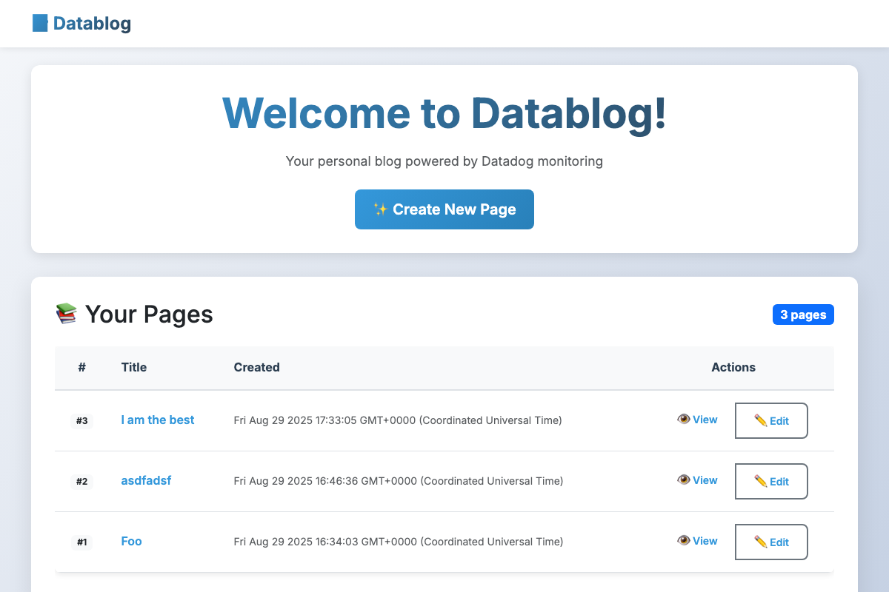
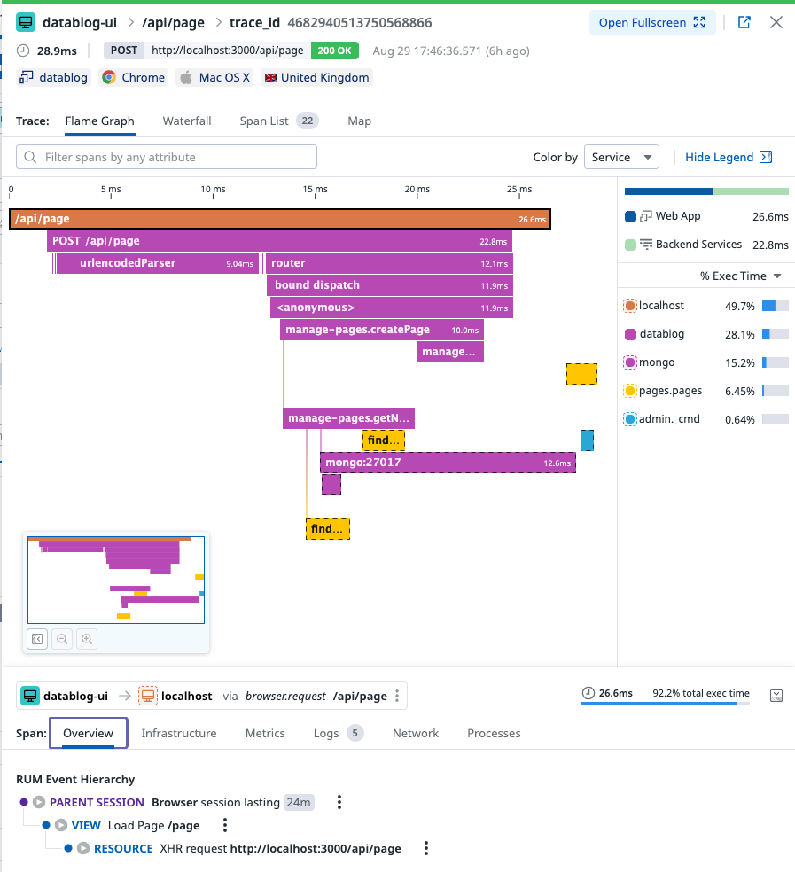

# Datablog - Datadog RUM & APM E2E Example

A blog application demonstrating end-to-end tracing with Datadog Real User Monitoring (RUM) and
Application Performance Monitoring (APM).

### App Screenshots



### Trace E2E Screenshot



## What This Project Does

**Datablog** is a full-stack blog application that demonstrates:

- **Real User Monitoring (RUM)**: Tracks user interactions, page views, and frontend performance
- **Application Performance Monitoring (APM)**: Monitors backend API calls, database queries, and
  custom instrumentation
- **Distributed Tracing**: Connects frontend requests to backend traces for end-to-end visibility
- **Custom Instrumentation**: Examples of manual span creation and custom metrics in RUM and APM
- **Error Tracking**: Captures both frontend and backend errors with context

## ⚠️ Caveats

This example uses a simplified architecture for demonstration purposes:

- **Monolithic Design**: Both frontend and backend run from the same Express.js application
- **Server-Side Rendering**: Uses EJS templates instead of a separate frontend framework
- **Development Focus**: Optimized for learning and demonstration rather than production use

**Note**: In real-world applications, you would typically:

- Separate frontend (React/Vue/Angular) and backend (API) into different services
- Use a proper frontend build process with bundling and optimization
- Implement proper CORS configuration for cross-origin requests
- Deploy services independently with their own scaling and monitoring

This simplified approach makes it easier to understand the RUM-APM integration concepts without the
complexity of microservices architecture.

## 🏗️ Architecture

```
┌─────────────────┐    ┌─────────────────┐    ┌─────────────────┐
│   Frontend      │    │   Backend       │    │   Database      │
│   (RUM)         │    │   (APM)         │    │   (MongoDB)     │
│                 │    │                 │    │                 │
│ • User          │───▶│ • Express.js    │───▶│ • Page Storage  │
│   Interactions  │    │ • Custom Spans  │    │ • Collections   │
│ • Page Views    │    │ • API Endpoints │    │                 │
│ • Performance   │    │ • Rate Limiting │    │                 │
└─────────────────┘    └─────────────────┘    └─────────────────┘
         │                       │                       │
         └───────────────────────┼───────────────────────┘
                                 │
                    ┌─────────────────┐
                    │   Datadog       │
                    │   Agent         │
                    │                 │
                    │ • Metrics       │
                    │ • Traces        │
                    │ • Logs          │
                    └─────────────────┘
```

## Getting Started

### Prerequisites

- Docker & Docker Compose
- Node.js 22.18.0+ (for local development)
- Datadog API Key
- Datadog RUM Application credentials

### Getting Started

1. **Clone and Setup**

   ```bash
   git clone https://github.com/petems/datadog-rum-apm-e2e-example
   cd datadog-rum-apm-e2e-example
   cp .env.example .env
   ```

2. **Configure Environment**

   ```bash
   # Edit .env with your Datadog credentials
   DD_API_KEY=your_api_key_here
   DD_RUM_APPLICATION_ID=your_rum_app_id
   DD_RUM_CLIENT_TOKEN=your_rum_client_token
   ```

3. **Deploy**

   ```bash
   docker-compose up -d
   ```

4. **Access Application**
   - Frontend: http://localhost:3000
   - MongoDB: localhost:27017
   - Datadog Agent: localhost:8126 (APM), localhost:8125 (StatsD)

### Local Development

1. **Install Dependencies**

   ```bash
   npm install
   ```

2. **Setup MongoDB**

   ```bash
   # Using Docker
   docker run -d -p 27017:27017 --name mongo mongo

   # Or install MongoDB locally
   ```

3. **Start Development Server**

   ```bash
   npm start
   ```

4. **Run Tests**
   ```bash
   npm test                    # Unit tests
   npm run test:coverage      # Coverage report
   npm run test:e2e          # End-to-end tests
   npm run test:e2e:ui       # E2E tests with UI
   ```

## 🔧 Development Workflows

### Code Quality

```bash
npm run lint              # Check code style
npm run lint:fix          # Auto-fix linting issues
npm run format            # Format code with Prettier
npm run format:check      # Check formatting
```

### Testing Strategy

- **Unit Tests**: Jest for backend logic and API endpoints
- **Integration Tests**: API testing with supertest
- **E2E Tests**: Playwright for full user journey testing
- **Visual Regression**: Automated screenshot comparison

### Monitoring Development

1. **Custom Instrumentation**: See examples in `controllers/manage-pages.js`
2. **RUM Configuration**: Configured in `config/rum.js`
3. **Custom Metrics**: StatsD integration for page views
4. **Error Tracking**: Automatic error capture and logging

### Database Operations

```bash
# Connect to MongoDB
docker exec -it mongo mongosh

# View collections
show collections

# Query pages
db.pages.find().pretty()
```

## Future Features

### Planned Enhancements

- **Authentication System**
  - User registration and login
  - JWT token management
  - Role-based access control
  - Session management with RUM user tracking

## 📸 Screenshots

### Homepage


_Screenshots are automatically updated via the `npm run screenshot` command_

## 🤝 Contributing

1. Fork the repository
2. Create a feature branch (`git checkout -b feature/amazing-feature`)
3. Commit your changes (`git commit -m 'Add amazing feature'`)
4. Push to the branch (`git push origin feature/amazing-feature`)
5. Open a Pull Request

### Development Guidelines

- Follow the existing code style (ESLint + Prettier)
- Write tests for new features
- Update documentation as needed
- Ensure all tests pass before submitting

## License

This project is licensed under the MIT License - see the [LICENSE](LICENSE.md) file for details.

## Support

- **Issues**: Report bugs and feature requests via GitHub Issues
- **Documentation**: Check the [Datadog documentation](https://docs.datadoghq.com/)
- **Community**: Join the [Datadog community](https://community.datadoghq.com/)

## Related Resources

- [Datadog RUM Documentation](https://docs.datadoghq.com/real_user_monitoring/)
- [Datadog APM Documentation](https://docs.datadoghq.com/tracing/)
- [Node.js Tracing Guide](https://datadoghq.dev/dd-trace-js/)
- [RUM-APM Integration Guide](https://docs.datadoghq.com/real_user_monitoring/connect_rum_and_traces/)
